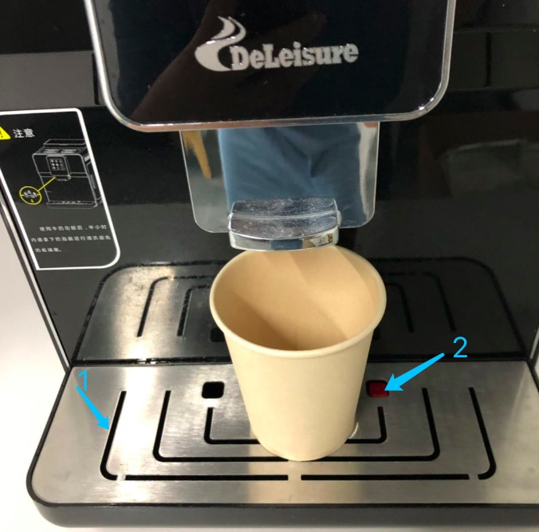

# 鸳鸯锅法案

本法案仅对 PingCAP 成都 office 有效。

## 货币单位

- 货币单位为“尹”，微尹 = 1 元，豪尹 = +∞

## 新同事入群规定

- 发红包，不得低于 200 微尹
- 爆照

## 咖啡机清理规定

- 大家在使用咖啡机的时候需要稍微注意下，如图片 1 的位置是 滴水盘，图片 2 位置滴水盘边上有个红色浮标。

    - 每次咖啡机重新启动的时候都会自动清洗内部机器，会产生部分液体流出来。这个时候请大家暂时先用这个一次性纸杯接一下，然后把废水倒到饮水机旁的茶水桶里。
    - 
    - 如果有部分液体滴到滴水盘里，当液体较多时，红色浮标就会漂浮起来，这个时候请大家看到就把滴水盘抽出来，把里面的水倒到茶水桶一下。不然滴水盘里的水太多，会流出来到处都是，感恩。
